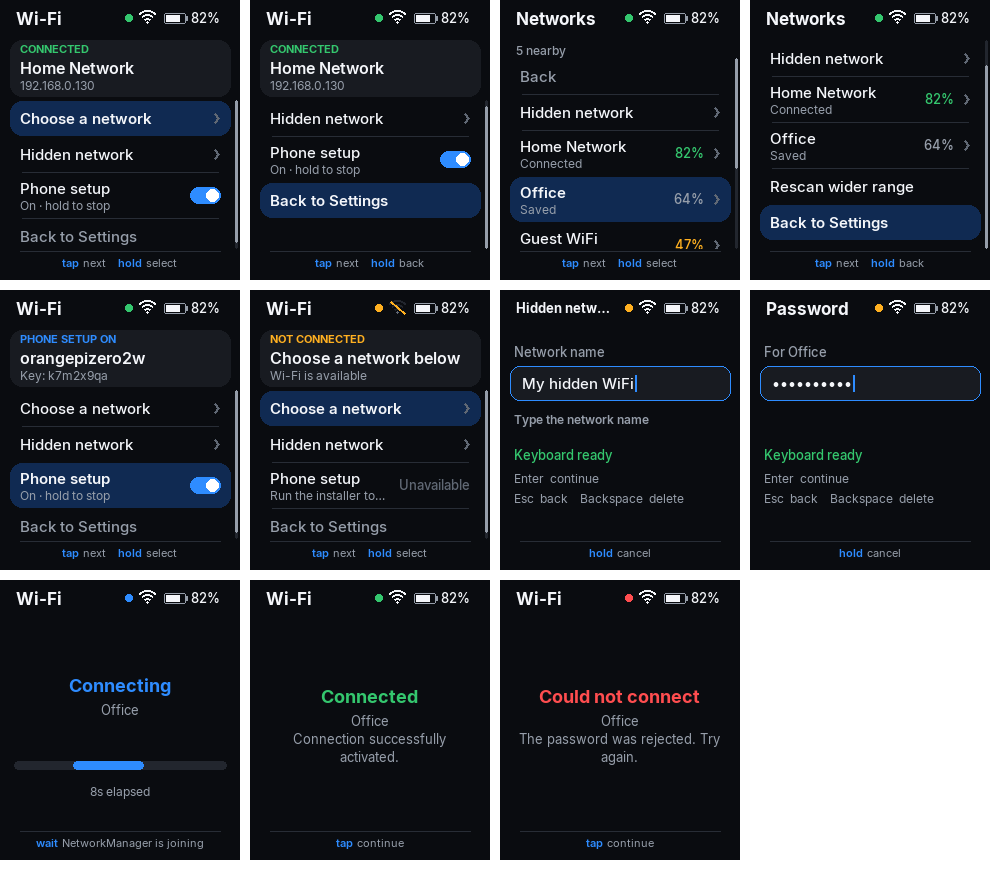

# Connect WiFi

Join a Wi-Fi network from the Whisplay HAT's screen on a Raspberry Pi or
Orange Pi, with the HAT's button and a USB or Bluetooth keyboard. For a
board with no keyboard, the app also switches PiSugar's Bluetooth LE
setup service on and off, so a phone can send the network name and
password instead.

It is a standalone, installable version of the *WiFi Config* app from
Whisplay's `example/wifi_config_app.py`, with the fixes listed under
[What changed](#what-changed-from-whisplays-wifi-config), and it replaces
Whisplay's own Wi-Fi apps on the desktop, in the built-in WiFi's place.



## Requirements

- Raspberry Pi (Raspberry Pi OS Bookworm or later) or Orange Pi Zero 2W/3W
  (Orange Pi OS or Armbian), with a Whisplay HAT.
- `whisplay-daemon` installed and running
  ([PiSugar/Whisplay](https://github.com/PiSugar/Whisplay)). It owns the
  HAT's screen and button, so the app needs it, and nothing else from
  Whisplay: see [Standalone](#standalone).
- NetworkManager managing the Wi-Fi interface (the default on both OSes).
- Python 3.9+, Pillow, NumPy (the installer offers to apt-install them).

## Install

From a development machine, one command copies the project and runs the
installer on the board (it asks for the board's sudo password there):

```bash
./deploy.sh orangepi@192.168.0.130 --setup
./deploy.sh pi@raspberrypi.local --setup
```

Or on the board itself:

```bash
git clone <this repo> ~/ConnectWifi   # or copy the folder over
cd ~/ConnectWifi
./setup.sh              # picks install-raspberrypi.sh or install-orangepi.sh
```

Run it as your normal user, not with `sudo`; it asks for sudo only for the
steps that need it, and asks before each change. Options, for either board:

| Option | Effect |
|--------|--------|
| `--check` | report only; change nothing |
| `--yes` | accept every prompt |
| `--no-ble` | leave out the Bluetooth LE setup service |
| `--keep-whisplay-wifi` | keep Whisplay's own WiFi entries on the desktop too |
| `--ble-name NAME --ble-key KEY` | what the phone sees and must send (default: the hostname and a random 8-character key) |
| `--country XX` | Raspberry Pi only: set the Wi-Fi country, without which Raspberry Pi OS keeps Wi-Fi blocked |

### What the installer does

1. Checks the board, and installs `python3-pil python3-numpy fonts-dejavu-core bluez curl rfkill` if missing.
2. Checks `whisplay-daemon` is running and answering on its socket.
3. Checks the radios. **Raspberry Pi:** `dtoverlay=disable-wifi/disable-bt` in `config.txt`, and the Wi-Fi country. **Orange Pi:** rfkill, the vendor Bluetooth service (`sprd-bluetooth`/`aw859a-bluetooth`), `bluetooth.service`.
4. Makes sure the app may scan and connect from under `whisplay-daemon`, outside any login session: your user in `netdev`, and, only if NetworkManager would refuse, a polkit grant for `netdev`. Polkit before 0.106 (Ubuntu 22.04 on the Orange Pi) gets a `.pkla` file, newer polkit a JavaScript rule. Then it keeps Wi-Fi up (see [Staying connected](#staying-connected)): it turns off Wi-Fi power saving where NetworkManager turns it on, and offers the `connectwifi-keepalive` service.
5. Installs PiSugar's `sugar-wifi-conf` to `/opt/sugar-wifi-config` as `sugar-wifi-config.service`. It runs each download once with `--help` before installing it: the newest release, v2.3.0, is built against glibc 2.39 (Ubuntu 24.04, Debian 13) and cannot start on Ubuntu 22.04 (Orange Pi OS), so there it falls back to v2.2.3, which needs glibc 2.30. A rerun replaces an installed copy that cannot run. The unit gives up after 5 failed starts instead of retrying forever. An existing install keeps its name and key. The info panel the phone shows (`setup/ble-info.json`) reads the temperature from sysfs, so it works on the Orange Pi too; PiSugar's default calls `vcgencmd`, which exists only on the Pi.
6. Adds `/etc/sudoers.d/connectwifi`, which allows exactly `systemctl start|stop sugar-wifi-config.service` without a password and nothing else. This is what the app's *Turn BLE on/off* runs. It is skipped only when sudoers already has a `NOPASSWD` rule covering both commands (read with `sudo -k -n -l`, so a sudo ticket cached earlier in the run cannot fool it).
7. Registers *Connect WiFi* on the HAT desktop, in the built-in WiFi's slot: between Bluetooth and Volume.
8. Offers to take Whisplay's own Wi-Fi entries off the desktop (see below), then restarts `whisplay-daemon` so the change takes effect. That closes the app on screen, so it asks first.
9. Runs the test suite if pytest is installed.

### Whisplay's own WiFi entries

Whisplay has two Wi-Fi apps, and Connect WiFi needs neither:

- the daemon's built-in **WiFi** (`whisplay-wifi`), listed from code in
  `InternalAppManager.builtin_apps()`, `daemon/internal_apps/manager.py`;
- the example **WiFi Config** (`whisplay-wifi-config`), listed by a desktop
  entry that Whisplay's daemon installer seeds from `daemon/default_apps/`.

`setup/whisplay_wifi.py` takes only their **menu entries** off; Whisplay's
code stays as PiSugar wrote it. For the built-in that is one line: its entry
in `builtin_apps()`. `wifi_app.py` and its hooks into the daemon's keyboard
and error handling are left alone; the app is simply never offered, so it
never runs. For the example, it removes the desktop entry and its seed, so
re-running Whisplay's installer does not list it again; the program stays.
Whisplay has no setting to hide a built-in app, and taking over its id does
not work either (the daemon opens its own WiFi screen for that id), so a
code edit is the only way.

It edits the checkout the running daemon comes from (read from the
service's `ExecStart`). `manager.py` differs between Whisplay versions, so
the edit is made and checked on the code's syntax tree. The result must be
the original minus that one entry, and nothing else. Otherwise the file is
put back and nothing changes. Everything it touches is first copied to
`daemon/internal_apps/.connectwifi-backup/`.

```bash
python3 setup/whisplay_wifi.py status  ~/Whisplay   # what is listed
python3 setup/whisplay_wifi.py hide    ~/Whisplay   # what the installer runs
python3 setup/whisplay_wifi.py restore ~/Whisplay   # what ./uninstall.sh runs
sudo systemctl restart whisplay-daemon              # after either
```

Updating Whisplay with `git pull` can conflict with the one-line edit:
restore first, pull, then run the installer again.

`./register.sh` puts the app back on the desktop without sudo, for
example after moving the folder. `./uninstall.sh` removes the desktop
entry, the sudo rule and the polkit grant, puts back Whisplay's own WiFi
apps if the installer removed them, and restarts the daemon;
`./uninstall.sh --ble` also removes `sugar-wifi-conf`.

### Standalone

The app loads no code from a Whisplay checkout. It speaks
`whisplay-daemon`'s socket protocol itself (`connectwifi/daemon_client.py`:
register, subscribe to events, take the foreground, draw into the shared
RGB565 framebuffer). Its keyboard reader is its own copy
(`connectwifi/keyboard.py`). So removing Whisplay's WiFi apps, examples or
`runtime/` cannot break it. The one exception: with no daemon running at
all, it falls back to driving the HAT directly, and that needs Whisplay's
hardware driver, `runtime/whisplay.py`. `tests/test_daemon_client.py` runs
the app against a fake daemon with no Whisplay on the machine, and checks
that no Whisplay module was loaded.

## Staying connected

On the Orange Pi Zero 2W, Wi-Fi could drop and stay down until someone
reconnected by hand, once for two hours. The board's logs show why:

1. The router drops the board (`CTRL-EVENT-DISCONNECTED reason=7`). Wi-Fi
   power saving makes this more likely, and it was on by mistake: the
   image turns it off in `20-override-wifi-powersave-disable.conf`, but
   NetworkManager reads config files alphabetically, so Ubuntu's
   `default-wifi-powersave-on.conf` is read last and turns it back on.
2. The Wi-Fi driver (`sprdwl`) botches the quick reconnect; the kernel
   logs a `cfg80211 __cfg80211_connect_result` warning. The failed
   handshake is reported as `WRONG_KEY`, though the password is right.
3. NetworkManager takes that at its word, asks for a new password,
   gets none on a headless board (`need-auth -> failed (no-secrets)`),
   and stops trying until someone reconnects by hand.

The installer fixes the first where it applies: it writes
`zz-connectwifi-wifi-powersave-off.conf`, named to sort after Ubuntu's
file, and switches power saving off at once with `iw`. It offers this only
where NetworkManager turns power saving on, since off costs some battery.

For the third it offers `connectwifi-keepalive`, a small service that
looks once a minute. When Wi-Fi is disconnected, and still is 15 s later,
it brings up the saved network used most recently among those in range.
It leaves alone Wi-Fi that is connecting or switched off, and a device
disconnected on purpose (`nmcli device disconnect`). It runs as your user,
not root, and takes about 11 MB. It logs only what it does:

```bash
journalctl -u connectwifi-keepalive           # what it has done
python3 -m connectwifi.keepalive --once       # one look, now
```

## Use

Pick **Connect WiFi** on the HAT desktop (hold the button), or run `./run.sh`.

| Input | Menu and lists | Typing a name or password |
|-------|----------------|---------------------------|
| Button, short press | next row | - |
| Button, hold 1 s | select | cancel |
| Button, 4 quick presses | back to the desktop | back to the desktop |
| Up / Down | move | - |
| Enter | select | next / connect |
| Esc | back (from the menu: leave) | back |
| Backspace | - | delete |

- **Scan networks** first shows what NetworkManager already has cached,
  above 40% signal: instant, and the radio stays idle. *Rescan wider
  range* sweeps and lists everything. An empty first pass sweeps on its own.
- **Type hidden network...** takes an SSID, then a password (blank for an
  open network).
- A network joined before shows **saved** in the list. Selecting it joins
  straight away with the stored password: no typing. If the network
  refuses it (the password changed), the password field opens with
  *Wrong password - type it again*. What you type replaces the stored
  password in that same profile, so no duplicates build up.
- A **new** network that refuses the password also returns to the
  password field rather than a dead end. A profile nmcli made during the
  failed attempt is deleted, so a wrong password is never left saved.
  Other failures, such as the network going out of range, show why on
  the result screen. Saved profiles themselves are never deleted.
- NetworkManager rejoins saved networks by itself, at boot and whenever
  one comes back in range; the app is for choosing one by hand.
- Selecting the network already in use does nothing but say so. WPA
  passwords shorter than 8 characters are caught on the spot rather than
  after nmcli times out.
- **Turn BLE on/off** starts or stops the Bluetooth setup service. The
  card above shows the name to look for and the key to enter on the phone.

The app logs to `~/.whisplay-daemon/daemon-app.log`, starting with one
line of what it may do, for example
`[connectwifi] wifi device=wlan0 sudo=False scan=True`.

## What changed from Whisplay's WiFi Config

- **BLE switch works when launched from the desktop.** The original decided
  whether to use sudo by probing `sudo -n true`. Its matching sudoers rule
  allows only `systemctl start|stop sugar-wifi-config.service`, so the probe
  failed, and the app ran plain `systemctl`, which polkit refuses outside a
  login session ("Interactive authentication required"). The app now runs
  `sudo -n systemctl start|stop` directly and falls back to plain systemctl.
- **No background scanning.** The status line polled
  `nmcli device wifi` every 2 seconds without `--rescan no`. nmcli's
  default sweeps whenever its cache is over 30 seconds old, so the radio
  rescanned every 30 seconds while the app was open. Every timed call now
  passes `--rescan no`.
- **Any Wi-Fi interface.** The interface is found through NetworkManager
  instead of assuming `wlan0`.
- **SSIDs containing `:`** are read correctly on the status line too.
- **Standalone.** It loads nothing from the Whisplay checkout: it has its
  own daemon client instead of `runtime/whisplay_client.py`, and its own
  keyboard reader instead of the daemon's `internal_apps/keyboard.py`
  (`connectwifi/keyboard.py`, Apache-2.0, credited in the file). See
  [Standalone](#standalone). Restarting the reader no longer leaves the old
  thread reading. Keypad Enter works.
- **Self-registration is complete.** Run by hand before the installer, it
  still registers a desktop entry that can launch it.
- **Its own app id** (`connectwifi`), so re-running Whisplay's installer,
  which re-seeds the example's entry, cannot overwrite it.
- **Menu shows when BLE is not installed** instead of offering a switch
  that cannot work.

## Troubleshooting

| Symptom | Cause and fix |
|---------|---------------|
| *Not allowed - run the installer again* | polkit or sudoers is missing a grant: run `./setup.sh` again. |
| Rescan says *cached (no scan permission)* | NetworkManager refuses scans from the daemon: `./setup.sh` adds the polkit grant. Restart `whisplay-daemon` if you were just added to `netdev`. |
| *No networks found* on a Pi | Wi-Fi country not set: `./install-raspberrypi.sh --country GB` (your code). |
| Menu says *NO BLE* | the BLE service is not installed: `./setup.sh` (or it was skipped with `--no-ble`). |
| *no kbd* | no keyboard with a full letter row is plugged in or paired. |
| *the service did not stay up* with `GLIBC_2.39 not found` | installed by an earlier version of this installer; run `./setup.sh` again and it swaps in v2.2.3. |
| The phone cannot find the board | `systemctl status sugar-wifi-config`; on an Orange Pi check `hci0` exists (`ls /sys/class/bluetooth`). |

## Development

```
connectwifi/
  app.py       state machine, workers, main loop
  screens.py   drawing (no hardware), View, RGB565
  network.py   nmcli output parsing and argument lists
  system.py    running commands; when to use sudo
  ble.py       sugar-wifi-conf status and switch
  keyboard.py  evdev keyboard reader
  keepalive.py brings Wi-Fi back when NetworkManager gives up
  daemon_client.py  whisplay-daemon protocol: register, events, framebuffer
  board.py     the board: through the daemon, or Whisplay's driver without one
setup/common.sh            shared installer steps
setup/whisplay_wifi.py     hides/restores Whisplay's own WiFi entries
install-raspberrypi.sh     Raspberry Pi steps
install-orangepi.sh        Orange Pi steps
setup.sh  deploy.sh  register.sh  uninstall.sh  run.sh
tests/
```

```bash
python3 -m pytest tests -q                     # 128 tests, no hardware needed
CONNECTWIFI_SCREENSHOTS=/tmp/shots python3 -m pytest tests/test_screens.py
```

The tests drive the app with a fake NetworkManager and systemd, so they run
anywhere. `tests/test_scripts.py` checks the shell scripts parse, and runs
shellcheck when it is installed.

## Credits

The keyboard reader and the app's design come from
[PiSugar/Whisplay](https://github.com/PiSugar/Whisplay) (Apache-2.0).
`sugar-wifi-conf` is [PiSugar's](https://github.com/PiSugar/sugar-wifi-conf),
downloaded from its releases at install time.
# ConnectWifi
